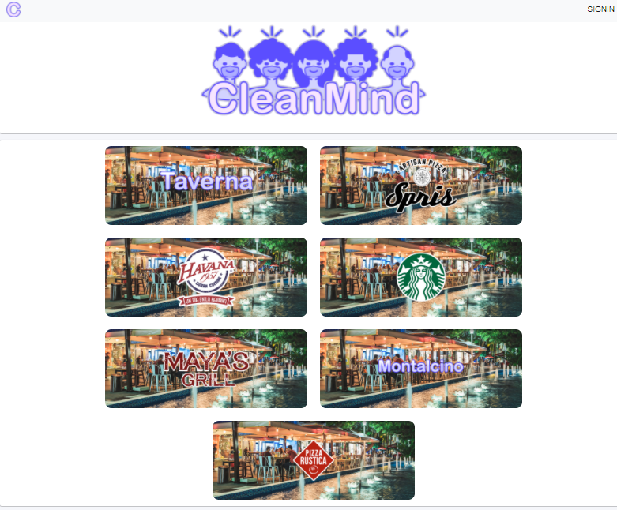
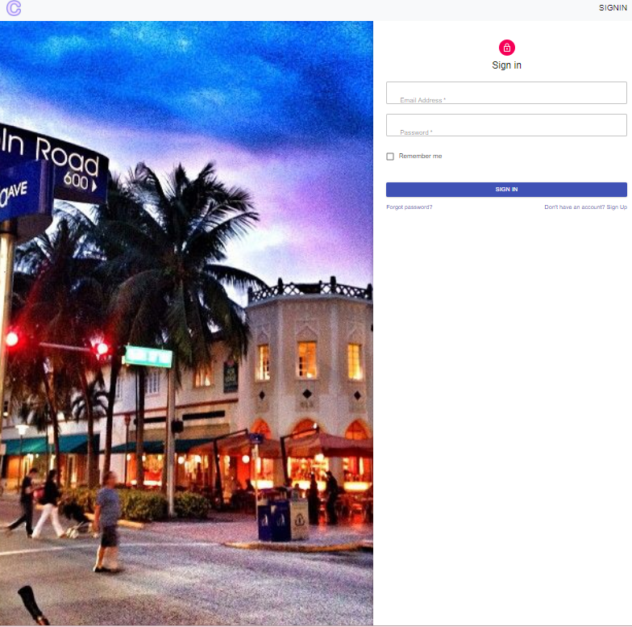
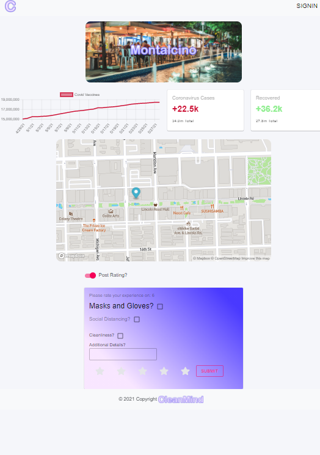

# Clean Mind

## Name:Sheree Britt, Lucas Diaz, Lismey Placencia, Robert Lanscoy, Mike Gordillo

## GitHub user name: https://github.com/SANELulu/Covid-Clean

## Table of contents:

- [Description](#description)
- [Installation](#Installation)
- [Usage](#usage)
- [License](#license)
- [Testing](#testing)
- [Questions](#questions)

## Description:

- Once signed in, this App will allow you to rate, leave comments and browse previous comments and ratings, for local restaurants in your area. Simply click on one of the restaurants and the user will be directed to a map view, with a marker for said resturant in the area with it's pinned location. This view will give the user acces to the covid cases count and recoverd cases to date in the states, as wel as a chart of the vaccine rates since april till current date. The App will provide a sense of security, for patrons trying to go out to dine and drink in this rapid changing setting, of a recovering world, and help us get back to enjoying our lives safely.

## Installation:

- Simply download the Repo, npm install and npm start

## Usage:

- First sign up, the sign in. Once you've registered, you'll have access to all the features and functionality of the App. Just explore, comment and rate local restaurants and enjoy the benefit of feeling safe in this, almost post pandemic world.

## license:

- MIT_License

## Contributing:

-

## Testing:

-

## Questions:

- Contact Sheree Britt, Lucas Diaz, Lismey Placencia, Robert Lanscoy, Mike Gordillo with any questions at mikegordillotattoo@gmail.com
  
  
  
  https://github.com/SANELulu/Covid-Clean
